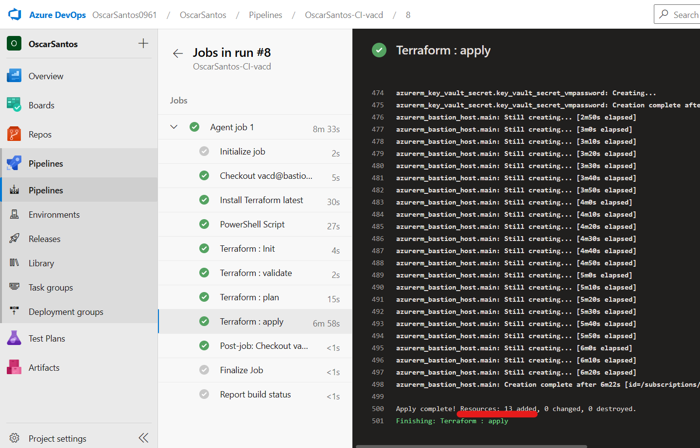
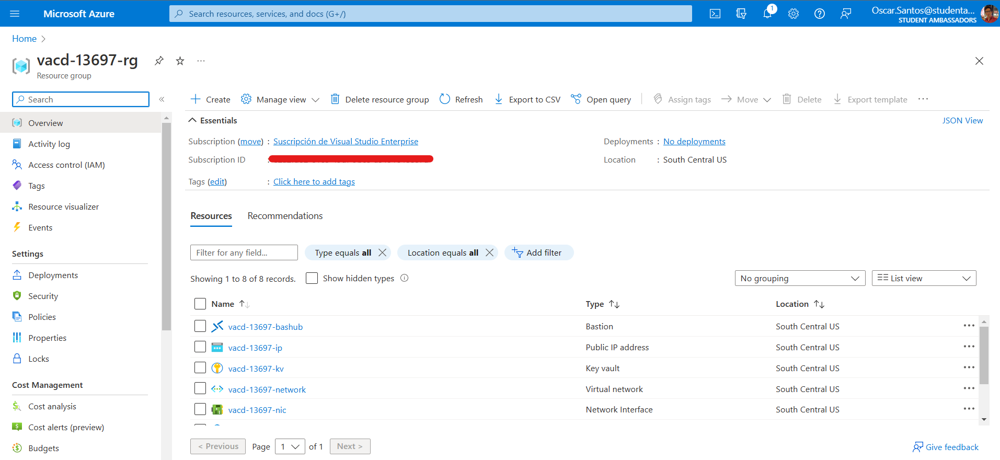
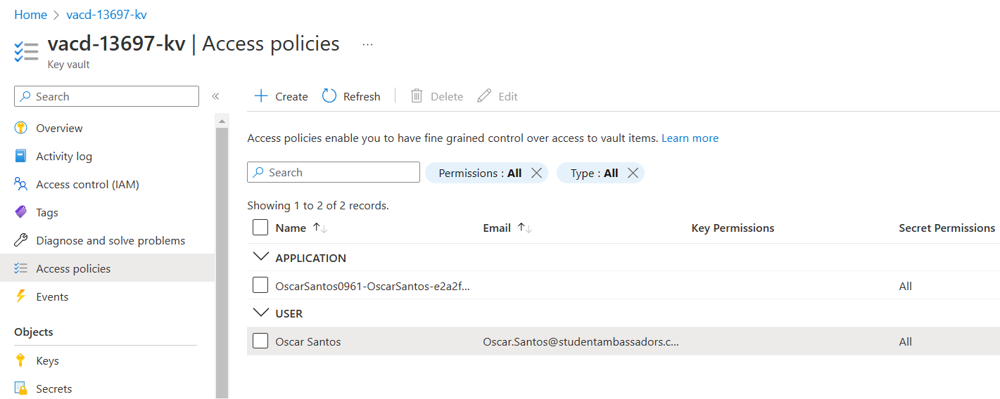
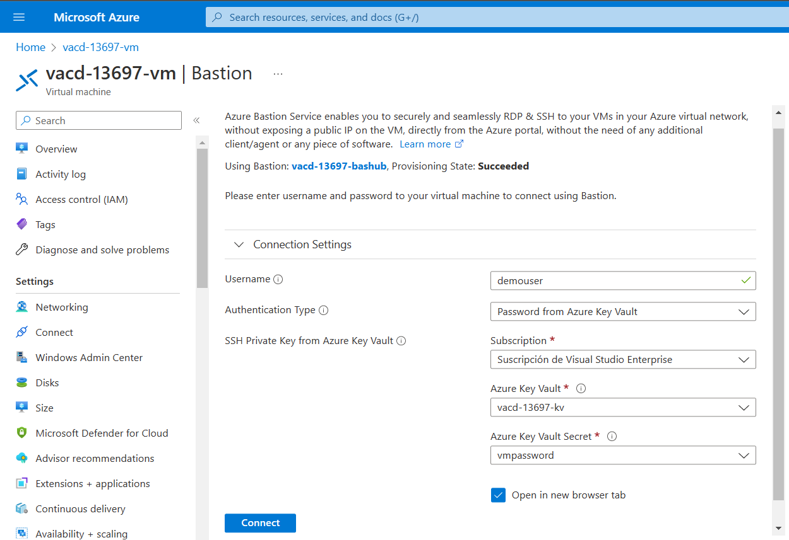

# Azure DevOps and Terraform, the perfect tools to manage infrastructure

> Workshop at [Virtual Azure Community Days](https://azureday.community/es-live-from-mexico/).  
> [🎥 Watch Replay](https://www.youtube.com/watch?v=3p_HPhpX6Qk)

## Table of Contents

1. [Context](#context)
2. [Branches](#branches)
    - [main](#main)
    - [iac](#iac)
    - [bastion/iac](#bastion)
    - [rdp/iac](#rdp)
3. [Demo](#demo)
    - [Initial Code](#initial-code)
    - [Final Code](#final-code)
    - [Final step](#final-step)
4. [Resources](#resources)

## Context
With the increase in cloud application development, the complexity of infrastructure management has increased as well. Although cloud solution providers (CSPs) provide us with much of the administration, there are still certain elements that remain our responsibility as a customer. This is why Infrastructure as Code (IaC) is having a big boom, coupled with automation through pipelines and code management that allow us to know exactly the status of the deployed infrastructure. In this session we will use Azure DevOps for the entire development lifecycle and Terraform within Azure Pipelines.

## Branches

### main
General info about the project

### iac
It will be used to demonstrate how changes are applied to infrastructure by leveraging the version control system.

### bastion/iac
main.tf has the bastion implementation

### rdp/iac
main.tf has the rdp implementation

## Demo

<details>
<summary><h3>Initial Code</h3> <i>click here</i></summary>

```t
resource "azurerm_resource_group" "resource_group" {
  name     = local.resource_group_name
  location = local.location
}

resource "azurerm_virtual_network" "main" {
  name                = local.virtual_network
  address_space       = ["10.0.0.0/16"]
  location            = azurerm_resource_group.resource_group.location
  resource_group_name = azurerm_resource_group.resource_group.name
}

resource "azurerm_subnet" "internal" {
  name                 = "internal"
  resource_group_name  = azurerm_resource_group.resource_group.name
  virtual_network_name = azurerm_virtual_network.main.name
  address_prefixes     = ["10.0.2.0/24"]
}

resource "azurerm_public_ip" "public_ip" {
  name                = local.public_ip
  location            = azurerm_resource_group.resource_group.location
  resource_group_name = azurerm_resource_group.resource_group.name
  allocation_method   = "Dynamic"
}

resource "azurerm_network_interface" "main" {
  name                = local.virtual_network_nic
  location            = azurerm_resource_group.resource_group.location
  resource_group_name = azurerm_resource_group.resource_group.name

  ip_configuration {
    name                          = "testconfiguration1"
    subnet_id                     = azurerm_subnet.internal.id
    private_ip_address_allocation = "Dynamic"
    public_ip_address_id          = azurerm_public_ip.public_ip.id
  }
}

resource "azurerm_network_security_group" "nsg" {
  name                = local.network_security_group
  location            = azurerm_resource_group.resource_group.location
  resource_group_name = azurerm_resource_group.resource_group.name

  security_rule {
    name                       = "RDP"
    priority                   = 300
    direction                  = "Inbound"
    access                     = "Allow"
    protocol                   = "Tcp"
    source_port_range          = "*"
    destination_port_range     = "*"
    source_address_prefix      = "*"
    destination_address_prefix = "*"
  }
}

resource "azurerm_network_interface_security_group_association" "example" {
  network_interface_id      = azurerm_network_interface.main.id
  network_security_group_id = azurerm_network_security_group.nsg.id
}

resource "azurerm_windows_virtual_machine" "example" {
  name                = local.virtual_machine_name
  resource_group_name = azurerm_resource_group.resource_group.name
  location            = azurerm_resource_group.resource_group.location
  size                = "Standard_F2"
  admin_username      = local.vm_user
  admin_password      = local.vm_user_password
  network_interface_ids = [
    azurerm_network_interface.main.id,
  ]

  os_disk {
    caching              = "ReadWrite"
    storage_account_type = "Standard_LRS"
  }

  source_image_reference {
    publisher = "MicrosoftWindowsServer"
    offer     = "WindowsServer"
    sku       = "2016-Datacenter"
    version   = "latest"
  }
}
```
</details>

<details>
<summary><h3>Final Code</h3> <i>click here</i></summary>

```t
resource "azurerm_resource_group" "resource_group" {
  name     = local.resource_group_name
  location = local.location
}

resource "azurerm_virtual_network" "main" {
  name                = local.virtual_network
  address_space       = ["10.0.0.0/16"]
  location            = azurerm_resource_group.resource_group.location
  resource_group_name = azurerm_resource_group.resource_group.name
}

resource "azurerm_subnet" "internal" {
  name                 = "internal"
  resource_group_name  = azurerm_resource_group.resource_group.name
  virtual_network_name = azurerm_virtual_network.main.name
  address_prefixes     = ["10.0.2.0/24"]
}

resource "azurerm_subnet" "bastionsubnet" {
  name                 = "AzureBastionSubnet"
  resource_group_name  = azurerm_resource_group.resource_group.name
  virtual_network_name = azurerm_virtual_network.main.name
  address_prefixes     = ["10.0.0.224/27"]
}

resource "azurerm_public_ip" "public_ip" {
  name                = local.public_ip
  location            = azurerm_resource_group.resource_group.location
  resource_group_name = azurerm_resource_group.resource_group.name
  allocation_method   = "Static"
  sku     = "Standard"
}

resource "azurerm_bastion_host" "main" {
  name                   = local.bastion_name
  location               = azurerm_resource_group.resource_group.location
  resource_group_name    = azurerm_resource_group.resource_group.name
  copy_paste_enabled     = true
  file_copy_enabled      = false
  sku                    = "Standard"
  
  ip_configuration {
    name                 = "configuration"
    subnet_id            = azurerm_subnet.bastionsubnet.id
    public_ip_address_id = azurerm_public_ip.public_ip.id
  }
}

resource "azurerm_network_interface" "main" {
  name                = local.virtual_network_nic
  location            = azurerm_resource_group.resource_group.location
  resource_group_name = azurerm_resource_group.resource_group.name

  ip_configuration {
    name                          = "testconfiguration1"
    subnet_id                     = azurerm_subnet.internal.id
    private_ip_address_allocation = "Dynamic"
  }
}

resource "azurerm_network_security_group" "bastion-nsg" {
  name = local.network_security_group
  resource_group_name = azurerm_resource_group.resource_group.name
  location = azurerm_resource_group.resource_group.location
  security_rule {
    name                       = "Allow_TCP_443_Internet"
    priority                   = 100
    direction                  = "Inbound"
    access                     = "Allow"
    protocol                   = "Tcp"
    source_port_range          = "*"
    destination_port_range     = 443
    source_address_prefix      = "Internet"
    destination_address_prefix = "*"
  }
  security_rule {
    name                       = "Allow_TCP_443_GatewayManager"
    priority                   = 110
    direction                  = "Inbound"
    access                     = "Allow"
    protocol                   = "Tcp"
    source_port_range          = "*"
    destination_port_range     = 443
    source_address_prefix      = "GatewayManager"
    destination_address_prefix = "*"
  }
  security_rule {
    name                       = "Allow_TCP_4443_GatewayManager"
    priority                   = 120
    direction                  = "Inbound"
    access                     = "Allow"
    protocol                   = "Tcp"
    source_port_range          = "*"
    destination_port_range     = 4443
    source_address_prefix      = "GatewayManager"
    destination_address_prefix = "*"
  }
  security_rule {
    name                       = "Allow_TCP_443_AzureLoadBalancer"
    priority                   = 130
    direction                  = "Inbound"
    access                     = "Allow"
    protocol                   = "Tcp"
    source_port_range          = "*"
    destination_port_range     = 443
    source_address_prefix      = "AzureLoadBalancer"
    destination_address_prefix = "*"
  }
  security_rule {
    name                       = "Deny_any_other_traffic"
    priority                   = 900
    direction                  = "Inbound"
    access                     = "Deny"
    protocol                   = "Tcp"
    source_port_range          = "*"
    destination_port_range     = "*"
    source_address_prefix      = "*"
    destination_address_prefix = "*"
  }
  security_rule {
    name                       = "Allow_TCP_3389_VirtualNetwork"
    priority                   = 100
    direction                  = "Outbound"
    access                     = "Allow"
    protocol                   = "Tcp"
    source_port_range          = "*"
    destination_port_range     = "3389"
    source_address_prefix      = "*"
    destination_address_prefix = "VirtualNetwork"
  }
  security_rule {
    name                       = "Allow_TCP_22_VirtualNetwork"
    priority                   = 110
    direction                  = "Outbound"
    access                     = "Allow"
    protocol                   = "Tcp"
    source_port_range          = "*"
    destination_port_range     = "22"
    source_address_prefix      = "*"
    destination_address_prefix = "VirtualNetwork"
  }
  security_rule {
    name                       = "Allow_TCP_443_AzureCloud"
    priority                   = 120
    direction                  = "Outbound"
    access                     = "Allow"
    protocol                   = "Tcp"
    source_port_range          = "*"
    destination_port_range     = "443"
    source_address_prefix      = "*"
    destination_address_prefix = "VirtualNetwork"
  }
}

resource "azurerm_windows_virtual_machine" "example" {
  name                = local.virtual_machine_name
  resource_group_name = azurerm_resource_group.resource_group.name
  location            = azurerm_resource_group.resource_group.location
  size                = "Standard_F2"
  admin_username      = local.vm_user
  admin_password      = local.vm_user_password
  network_interface_ids = [
    azurerm_network_interface.main.id,
  ]

  os_disk {
    caching              = "ReadWrite"
    storage_account_type = "Standard_LRS"
  }

  source_image_reference {
    publisher = "MicrosoftWindowsServer"
    offer     = "WindowsServer"
    sku       = "2016-Datacenter"
    version   = "latest"
  }
}

resource "azurerm_key_vault" "key_vault" {
  name                       = local.key_vault_name
  location                   = azurerm_resource_group.resource_group.location
  resource_group_name        = azurerm_resource_group.resource_group.name
  tenant_id                  = data.azurerm_client_config.current.tenant_id
  sku_name                   = "standard"
  soft_delete_retention_days = 7

}

resource "azurerm_key_vault_access_policy" "key_vault_access_policy_sp" {
  key_vault_id = azurerm_key_vault.key_vault.id
  tenant_id    = data.azurerm_client_config.current.tenant_id
  object_id    = data.azurerm_client_config.current.object_id

  secret_permissions = [
    "Backup", "Delete", "Get", "List", "Purge", "Recover", "Restore", "Set"
  ]
}

resource "azurerm_key_vault_secret" "key_vault_secret_vmpassword" {
  name         = "vmpassword"
  value        = local.vm_user_password
  key_vault_id = azurerm_key_vault.key_vault.id

  # prevents race condition when the secret is getting created before the access policy, causing 401
  depends_on = [
    azurerm_key_vault_access_policy.key_vault_access_policy_sp
  ]
}
```
</details>

### Final step

Add a PowerShell script task after terraform install task, and use an inline script with the content of [create-backend.ps1](script/create-backend.ps1), that script will create a **backend.tf** at the pipeline working directory, inside the *iac* folder.

Later, change the config directory to *iac* for each terraform task.

Run the pipeline.



After success, review your resource groups. It should be there.


Add an access policy to make the secret visible to you.


Connect to the vm with bastion using a secret from the created azure key vault.


### Remote state

If you are planning to use the terraform state from the storage account outside of the azure pipeline you will need the following file in the *iac* folder.

You will need to have an existing storage account with a blob container.
```t
# Define Terraform backend using a blob storage container on Microsoft Azure for storing the Terraform state
terraform {
  backend "azurerm" {
    resource_group_name  = "your_resource_group_name"
    storage_account_name = "your_storage_account_name"
    container_name       = "your_container_name"
    key                  = "terraform.tfstate"
  }
}
```

## Resources

### Azure DevOps
* [Azure DevOps](https://azure.microsoft.com/es-es/products/devops/?wt.mc_id=studentamb_118941)
* [Azure DevOps docs](https://learn.microsoft.com/en-us/azure/devops/user-guide/what-is-azure-devops?view=azure-devops&wt.mc_id=studentamb_118941)

### Terraform

* [Terraform Registry](https://registry.terraform.io/browse/providers)
* [HashiCorp Configuration Language (HCL)](https://github.com/hashicorp/hcl)
* [Terraform Cheat sheet](https://spacelift.io/blog/terraform-commands-cheat-sheet)
* [Terraform Azure](https://developer.hashicorp.com/terraform/tutorials/azure-get-started)
* [Terraform Azure Examples](https://github.com/alfonsof/terraform-azure-examples)